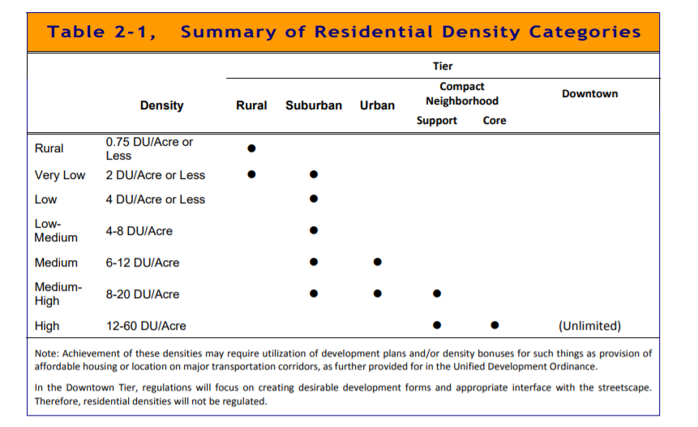

##UNDER CONSTRUCTION:


 

## Vapid & Plastic

Take a stroll down any street in Durham, which many on this blog have called the Mecca of the South, and an ubiquitous lawn ornament is the variety of signs. Black lives matter. Science is Real. Housing is a Human Right. Stop the Steal. 

No, I'm kidding about the last one, at least thoe aren't prevelant in my neighborhoods. 

Those signs are virtue signaling in my opinion. But I'm not here to argue about lawn signs. I found myself wondering, are Durham zoning laws reflective of a majority Democratic enclave, a quickly growing liberal bubble? 


Are Durham's zoning ordinances aligned with beliefs of all those stupid lawn signs? 


```{r setup, include=FALSE}
knitr::opts_chunk$set(warning = FALSE, message = FALSE)
library(caliperR)
library(nngeo)
library(tcadr)
library(sf)
library(leaflet)
library(PL94171)
library(janitor)
library(dplyr)
library(tidycensus)
library(tidyverse)
options(tigris_use_cache = TRUE)
library(sf)
library(data.table)
library(dplyr)
library(plotly)


# remotes::install_github("walkerke/tidycensus")
# remotes::install_github("walkerke/tigris")
library(tidycensus)
library(tidyverse)
library(tigris)

vars_2020 <- load_variables(2020,"pl",cache=TRUE)
vars_2010 <- load_variables(2010,"sf1", cache=TRUE)
vars_2019 <- load_variables(2019,"acs5", cache=TRUE)


zones <- st_read("C:/Users/JacobFo/OneDrive - City of Durham/GitHub/Personal Blog/Personal Blog/_posts/2021-12-08-Quantifying-NIMBYism/Zoning.shp")


summary(zones)


```
 
 
 
## EDA 

Durham's zoning data is publicly available, and is classified in an understandibly complex manner. Below are the initial zone types: 

```{r echo=FALSE, message=FALSE, warning=FALSE}
table(zones$ZONE_GEN)
```
As you can see, a lot of these can be collapsed. 

As the songbird of our generation Carly Rae Jepson once said, let's cut to the feeling. 

Collapse each zone into residential, commerical/university, and other - comprising municipal buildings, fire stations, schools, etc. 


```{r message=FALSE, warning=FALSE, include=FALSE}
res_words <- paste("RESIDENTIAL", "RES", sep = "|")

commerical_words <- paste("COMMECIAL", "COMMERCIAL", "UNIVERSITY","OFFICE", "INDUST", "MIXED", 'COMPACT',sep = "|")

  
zones <- zones %>%
  mutate(
    zone_flag = case_when(
      grepl(commerical_words, ZONE_GEN) ~ "Commerical",
      # ZONE_GEN == "RES_LOW_DENSITY" ~ "Low Density Res",
      # ZONE_GEN == "RES_MEDIUM_DENSITY" ~ "Medium Density Res",
      # ZONE_GEN == "RES_HIGH_DENSITY" ~ "Low High Res",
      grepl(res_words, ZONE_GEN) ~ "Residential",
      TRUE ~ "Other"
      )
    )
```


```{r echo=FALSE, message=FALSE, warning=FALSE}


pal <- colorFactor(
  palette='Dark2',
  domain=zones$zone_flag
)

zone_map <- leaflet() %>%
  addProviderTiles("CartoDB.Positron") %>%
  setView(-78.90390102117877,35.998220055791876,  zoom=14)%>%
  addPolygons(data=zones,
              weight=1,
              color=~pal(zone_flag),
              popup=paste("Zone Type: ", zones$zone_flag, "<br>",
                          "Detailed Zone:", zones$ZONE_GEN)) %>%
  addLegend(
    position="bottomright",
    pal=pal,
    values=zones$zone_flag
  )


zone_map
```

## Get your snorkles, we're diving in. 


The Mecca of the South categorizes zoning by the following table, available in the [Durham Comprehensive Plan](https://durhamnc.gov/DocumentCenter/View/9020/2-Land-Use): 

```{r echo=FALSE, message=FALSE, warning=FALSE}


res_zones <- zones %>%
  filter(zone_flag == "Residential") %>%
  mutate(
    zone_flag = case_when(
     ZONE_GEN == "RES_LOW_DENSITY" ~ "Low Density",
     ZONE_GEN == "RES_MEDIUM_DENSITY" ~ "Medium Density",
     ZONE_GEN == "RES_HIGH_DENSITY" ~ " High Density"
      ),
    dwell_units = case_when (
      zone_flag == "Low Density" ~ ACRES * 4, na.rm=T,
      zone_flag == "Medium Density" ~ ACRES * 9, na.rm=T,
      zone_flag == "High Density" ~ ACRES * 36, na.rm=T
    )
    )
res_zones$dwell_units <- ifelse( zone_flag=="Low Density", res_zones$dwell_units * 4, na.rm=)


pal <- colorFactor(
  palette='Dark2',
  domain=res_zones$zone_flag
)

zone_map <- leaflet() %>%
  addProviderTiles("CartoDB.Positron") %>%
  setView(-78.90390102117877,35.998220055791876,  zoom=14)%>%
  addPolygons(data=res_zones,
              weight=1,
              color=~pal(zone_flag),
              popup=paste("Zone Type: ", res_zones$zone_flag, "<br>",
                          "Detailed Zone:", res_zones$ZONE_GEN, "<br>",
                          "Zoned for ", res_zones$dwell_units, "Dwell Units maximum", "<br>",
                          "Acres: ", res_zones$ACRES)) %>%
  addLegend(
    position="bottomright",
    pal=pal,
    values=res_zones$zone_flag
  )


zone_map


```


### Add HHs in from the 2020 Census 


1. underutilization rate - zoning vs occupied:
2. NIMBY score: percentage of population living in low density homes (low, med, high)

```{r}

```


## References

1. https://medium.com/@NYUurbanlab/actually-nimbys-cities-arent-building-enough-51806be038ae
2. https://abundanthousingla.org/meet-l-a-countys-biggest-nimbys/
3. https://live-durhamnc.opendata.arcgis.com/datasets/zoning/explore?location=36.012451%2C-78.920767%2C15.62

4. https://maps.durhamnc.gov/?x=36.01483037908998&y=-78.92072715568013&z=18055.9548215&r=0&b=11&pid=NA&s=zoning&l=active_address_points,countymask,transitionalofficeoverlay,NPO,NHD,LocHistLandmarks,airportoverlay,citylimits,RTPboundary,parcels,zoning,


